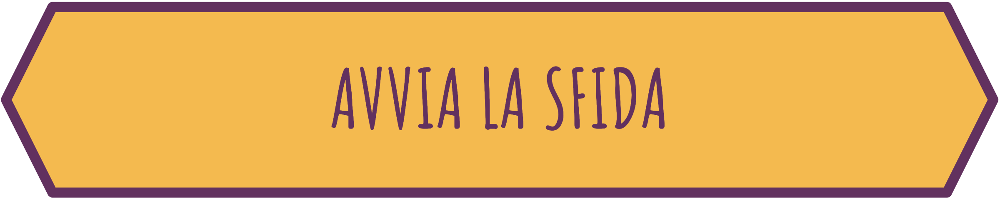

# Duomondo Demo

AR experience based on Duomondo Project using Endymion AR library


## Features

- Render 3D assets with a simple javascript code
- Using more than one location for experience
- Interact with HTML element to collect 3D assets


## Getting Started

For run demo you have to perform this step:   

1 - Download with your device (Android) the Endymion Browser apk scanning this qr code and clicking on "Download Beta"        
    (registration is required)   

    


2 - Install Docker on your computer, download available here: [Docker Download](https://docs.docker.com/desktop/)

3 - open your computer firewall for 8081 tcp port   
for linux
```bash
    sudo ufw allow 8084
```
for windows using powershell with admin privilege
```powershell
netsh advfirewall firewall add rule name="duomondo-demo" dir=in action=allow protocol=TCP localport=8081
```
    
## Run Locally

Clone the project, go to the project directory, install dependencies and run demo

```bash
git clone https://github.com/EndymionDemo/duomondo-demo.git  
cd duomondo-demo    
npm install   
npm run start   

```
Ensure that your smartphone and your computer are connected to same wifi/LAN        
And Finally scan QR Code that appear in terminal with Endymion Browser App and visualize assets


To stop demo    

```bash
  npm run stop
```

## Usage/Examples
In Demo folder there are some files and folders used for experience        
Folders     
1 - assets folder - 3D assets           
2 - audio folder - audio used in animation           
3 - images folder - used images     
4 - js folder - endymion.js library         
5 - style folder - css stylesheet     

Files       
1 - *.arsd - tell to endymion app some stuff that describe scene        
2 - *.html - describe 3D experience with html and using endymion.js library     

Lets explore index.html
```html
<!DOCTYPE html>
<html>
<head>
    <title>Duomondo</title>
    <script src="./js/endymion.js"></script>
    <link rel="stylesheet" href="./style/main.css">
    <script>
    
    window.onload = (event)=>{
        //select the voice of ippo
        var voice = document.getElementById('audioPlayer');
        // load 3D asset, configure and render 
        var ippo = endymion.loadAsset("assets/ippotest5.glb")
                                .setPosition({ x: 0, y: -0.3, z: 0 })
                                .setRotation({ x: -10, y: 220, z: 0 })
                                .setScale({ x: 3, y: 3, z: 3 })
                                .render();
    
       //event listener on button click event
        listenToTheSpirit = function() {
            //ask to endymion library to animate ippo with animation at index 1
            endymion.with(ippo).playAnimation(1).apply();
            //play voice
            voice.play()
        }
    }
    </script>
</head>


<body>
    <!-- define voice source -->
    <audio id="audioPlayer" src="./audio/demo_ippo.mp3"></audio>

    <div class="button-container">
        <!-- button to start experience -->
        <a class="button" href="controllarisultato_1.html">
            
        </a>
        <!-- button to listen ippo-->
        <div class="button"; onclick="listenToTheSpirit()">
            
        </div>
    </div>
</body>
</html>
```


## License

[MIT](https://choosealicense.com/licenses/mit/)

